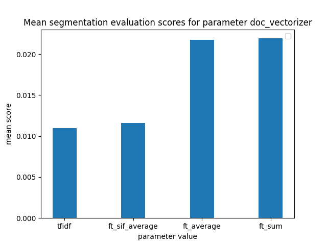
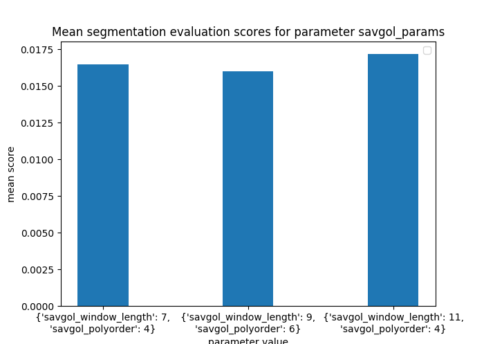
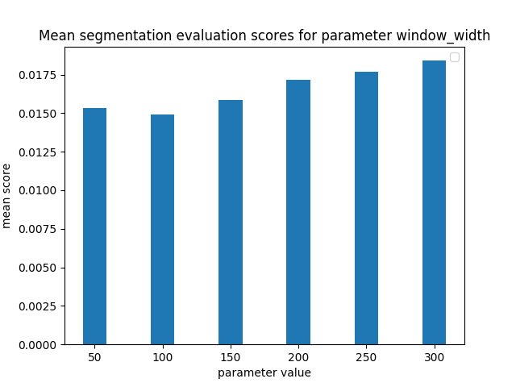

# evaluation and tuning script for podcast-chapterize

This script aims to evaluate different combinations of (hyper-)parameters for the chapterization process of the [podcast-chapterize project](https://github.com/stereolith/podcast-chapterize/). The chapterization process automatically segments a transcript (or any long text) into topically cohesive parts. To test the quality of the automatic segmentation, transcripts of podcast episodes that are already published with chapter information included are used as a basis for the segmentation. Segmentation results from the chapterization process are compared against the chapter markers that were published with the corresponding podcast episode.

The text segmentation process is an adapted version of the TextTiling algorithm. It can be tuned by setting various parameters. Different document embedding algorithms were implemented and should be evaluated as well. A collection of podcast episodes which are published with chapter markers are used as the gold standard to test various combinations of parameters of the chapterization process.

In the following steps, functions and CLI functionality from the [podcast-chapterize project](https://github.com/stereolith/podcast-chapterize/) are used. Refer to its README for an in-depth documentation. Here, the repo is included as a git submodule.

## fetching and preprocessing gold standard data

Script: **transcripts/auto_transcript.py**

The list of podcasts that are used for this evaluation can be found in the 'transcribe/auto_transcript.py' file.
Using the `transcribe` subcommand of the podcast-chapterize CLI, transcripts are made for podcast episodes. Chapter information is extracted with setting the `-c` option. For each episode, the transcript, the chapter information and the language is saved to a json file in the '/transcripts' directory.

Script: **preprocess_transcripts.py**

The transcripts are preprocessed in this script. To improve performance by reducing redundant tasks, lemmatization and lookup of FastText word vectors is done in bulk before the actual chapterizer process evaluation. The resulting transcripts python list object is saved as a pickle file. The Dockerfile describes a build process for a docker container that includes that preprocessed data to help run it on other machines.

## evaluation process

Script: **eval_chapterization.py**

The transcript data is loaded from the pickle file created in the previous step. 
The following parameters are to be tested and evaluated using the gold standard data:

- **window_width**: Size (number of tokens) of segment in initial segmentation
- **savgol params**: Parameters for Savitzky-Golay smoothing filter 
    - **savgol_window_length**: window_length parameter for Savitzky-Golay filter
    - **savgol polyorder**: polyorder parameter for Savitzky-Golay filter

- one **document embedding algorithm** needs to be chosen from these options:
    - tf-idf weighted term-document matrix
        - includes parameters: **min-df** and **max-df**
    - FastText word vectors, sum (ft_sum)
    - FastText word vectors, average (ft_average)
    - Average of SIF-weighted FastText word vectors (ft_sif_average)

Using a set of possible values for each parameter of the ChapterizerParameter class, a list of ChapterizerParameter objects that includes all possible parameter combinations is generated.

These parameter combinations are used to run the chapterize-function to obtain an automatic segmentation for each transcript.

To compare the automatic segmentation and the gold standard, the [segeval](https://segeval.readthedocs.io/en/latest/) package is used. The **boundary similarity** score is calculated using the **boundary edit distance** metric to score segmentations.

## evaluation results
First results from the evaluation process show that the following parameters work well with the tested data:
- **window_width** 50
- **savgol_params**:
    - **savgol_window_length**: 4
    - **savgol_polyorder** 11
- **doc_vectorizer** ft_sum

The following plots show how the segmentation algorithm performed on average with different values for the __window width__ (window_width), savgol smoothing (savgol_params) and document vectorizer (doc_vectorizer) parameters. The scores of all segmentations that were calculated with the given parameter value were collected and averaged.

Generally, a larger window width seems to work well and document vectorization with averaged or summed up FastText word vectors outperform tfidf document-vector vectorization and sif-weighted FastText document vectors.

